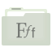

# custom-fluent-folder-icons

A collection of custom SVG icons I made in InkScape, based on the [Fluent Icon Theme](https://github.com/vinceliuice/Fluent-icon-theme) by [vinceliuice](https://github.com/vinceliuice). If I make any more in the future, they will be added here. 

## Preview

| Art | Dropbox | Fonts | Google Drive | Writing |
| :---: | :---: | :---: | :---: | :---: |
|  |  |  |  |  |

| HakuNeko | MuseScore | Personal | Python |  XnConvert |
| :---: | :---: | :---: | :---: | :---: |
|  |  |  |   |  |

| Obsidian | Obsidian Exports | Obsidian Imports |  TinyMediaManager |
| :---: | :---: | :---: | :---: |
|  |  |  |  |  |

## Download
Click on the icon you want, or zip the entire icons directory to download them all. 

## ⚖️ License & Credits
This project is licensed under the **GNU General Public License v3.0**, which means you can freely share and modify these icons, provided that they remain under the GPL v3 license.
