# custom-fluent-folder-icons

A collection of custom SVG icons I made in InkScape, based on the [Fluent Icon Theme](https://github.com/vinceliuice/Fluent-icon-theme) by [vinceliuice](https://github.com/vinceliuice). If I make any more in the future, they will be added here. 

## Preview

### Common Categories
| Downloads | Documents | Pictures | Music | Temporary | Personal |
| :---: | :---: | :---: | :---: | :---: | :---: |
|  | 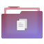 | 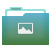 |  |  |  |

### Creative
| Art | Fonts | Writing | Gimp | Inkscape | Blender | Brushes |
| :---: | :---: | :---: | :---: | :---: | :---: | :---: |
|  | 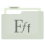 |  | 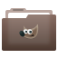 | 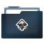 |  |  |

### Media 1
| Jellyfin | Spotify | Youtube | Movies | MusicBee | TinyMediaManager |
| :---: | :---: | :---: | :---: | :---: | :---: |
| 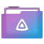 | 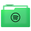 |  |  | 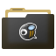 |  |

### Media 2
| Books | Calibre | Torrents | HakuNeko | Comics | Manga |
| :---: | :---: | :---: | :---: | :---: | :---: |
|  | 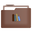 | 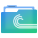 | 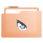 |  | 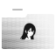 |

### Storage
| Dropbox | GoogleDrive | Obsidian | Obs. import | Obs. export |
| :---: | :---: | :---: | :---: | :---: |
|  | 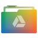 | 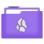 |  | 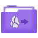 |

### Gaming
| Games | Steam | Unity | Emulation | MelonDS | mGBA | Pokemon |
| :---: | :---: | :---: | :---: | :---: | :---: | :---: |
|  |  |  | 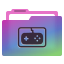 |  | 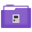 | 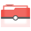 |

### Other 1
| Coding | Python | Flatpak | AppImage | Github |
| :---: | :---: | :---: | :---: | :---: |
| 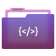 | 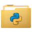 | 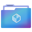 | 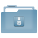 |  |

### Other 2
| XnConvert | MuseScore | FreeCad | VirtualBox | Reddit |
| :---: | :---: | :---: | :---: | :---: |
|  |  | 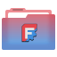 | 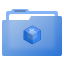 |  |

### Colors
The default folder colors in the Fluent theme are: blue, red, yellow, purple, pink, orange, grey, and green. Here are some others:

| aurora | cyan | frost | grass | lemon | sand | solarized | teal | wine |
| :---: | :---: | :---: | :---: | :---: | :---: | :---: | :---: | :---: |
| 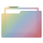 |  |  |  | 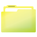 |  | 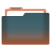 |  | 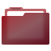 |

### Colors & Patterns (experimental)
| Rainbow | Mondrian | Chess | Camouflage |
| :---: | :---: | :---: | :---: |
| 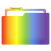 | 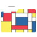 | 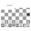 | 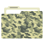 |

## Download
Click on the icon you want, or zip the entire icons directory to download them all. 

## License & Credits
This project is licensed under the **GNU General Public License v3.0**, which means you can freely share and modify these icons, provided that they remain under the GPL v3 license.
