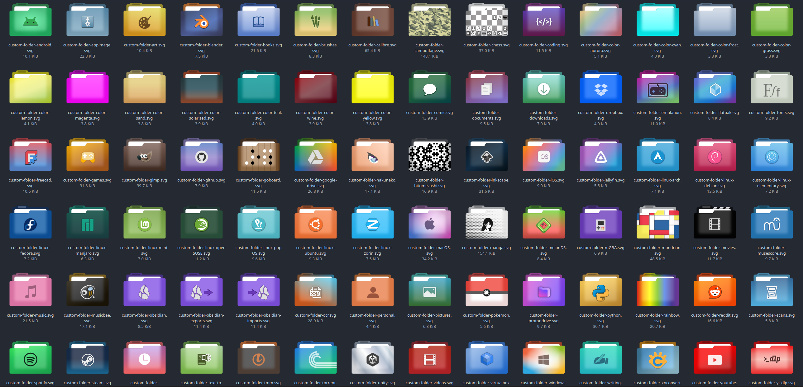
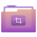
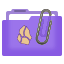
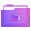
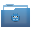
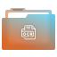
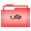
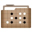
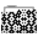

# custom-fluent-folder-icons

A collection of custom SVG icons I made in InkScape, based on the [Fluent Icon Theme](https://github.com/vinceliuice/Fluent-icon-theme) by [vinceliuice](https://github.com/vinceliuice). If I make any more in the future, they will be added here. 

## Preview

## By Category

### System & Standard Folders 1
| Downloads | Documents | Music | Videos | Pictures |
| :---: | :---: | :---: | :---: | :---: |
|  |  |  |  |  |

### System & Standard Folders 2
| Screenshots | Personal | Temporary |
| :---: | :---: | :---: |
|  |  |  |

### 2D Art & Graphics
| Art | Brushes | Gimp | Inkscape |
| :---: | :---: | :---: | :---: |
|  |  |  |  |

### 3D & CAD Design
| Blender | FreeCad | KiCad |
| :---: | :---: | :---: |
|  |  |  |

### Writing
| Writing | Notes | Fonts | Text-to-Speech | Chronicler |
| :---: | :---: | :---: | :---: | :---: |
|  |  |  |  |  |

### Obsidian
| Obsidian | Obs. export | Obs. import | Obsidian Webclipper |
| :---: | :---: | :---: | :---: |
|  |  |  |  |

### Cloud & File Storage
| Dropbox | GoogleDrive | ProtonDrive |
| :---: | :---: | :---: |
|  |  |  |

### Audio & Music
| Spotify | MusicBee | MuseScore | Navidrome |
| :---: | :---: | :---: | :---: |
|  |  |  |  |

### Video & Streaming
| Jellyfin | Movies | OBS-studio | Youtube | TinyMediaManager |
| :---: | :---: | :---: | :---: | :---: |
|  |  |  |  |  |

### Books, Comics & Manga
| Books | Calibre | Comics | Manga | HakuNeko |
| :---: | :---: | :---: | :---: | :---: |
|  |  |  |  |  |

### Gaming & Emulation
| Games | Steam | Emulation | MelonDS | mGBA |
| :---: | :---: | :---: | :---: | :---: |
|  |  |  |  |  |

### Software Development
| Coding | Github | Python | Visual Studio Code | VSCodium |
| :---: | :---: | :---: | :---: | :---: |
|  |  |  |  |  |

### Game Development
| Godot | Pygame | Unity |
| :---: | :---: | :---: |
|  |  |  |

### Virtualization & Packaging
| AppImage | Flatpak | VirtualBox |
| :---: | :---: | :---: |
|  |  |  |

### Linux Distros 1
| Arch | Debian | Fedora | Mint | Ubuntu |
| :---: | :---: | :---: | :---: | :---: |
|  |  |  |  |  |

### Linux Distros 2
| Elementary | Manjaro | OpenSUSE | PopOS | ZorinOS |
| :---: | :---: | :---: | :---: | :---: |
|  |  |  |  |  |

### Image Processing
| OCR | Scans | XnConvert |
| :---: | :---: | :---: |
|  |  |  |

### Social Media
| Instagram | Reddit |
| :---: | :---: |
|  |  |

### Downloading
| Torrents | yt-dlp | JDownloader |
| :---: | :---: | :---: |
|  |  |  |

### Pop Culture & Media
| One Piece | Pokemon |
| :---: | :---: |
|  |  |

### Color Themes 1
| aurora | frost | grass | lemon | sand |
| :---: | :---: | :---: | :---: | :---: |
|  |  |  |  |  |

### Color Themes 2
| Cyan | Magenta | Yellow | solarized | teal | wine |
| :---: | :---: | :---: | :---: | :---: | :---: |
|  |  |  |  |  |  |

### Patterns 1
| Camouflage | Chess | Go Board | Mondrian | Rainbow |
| :---: | :---: | :---: | :---: | :---: |
|  |  |  |  |  |

### Patterns 2
| Glass | Hitomezashi | Lego | Piano | World Map |
| :---: | :---: | :---: | :---: | :---: |
|  |  |  |  |  |

## Download
Click on the icon you want, or zip the entire icons directory to download them all. 

## License & Credits
This project is licensed under the **GNU General Public License v3.0**, which means you can freely share and modify these icons, provided that they remain under the GPL v3 license.
